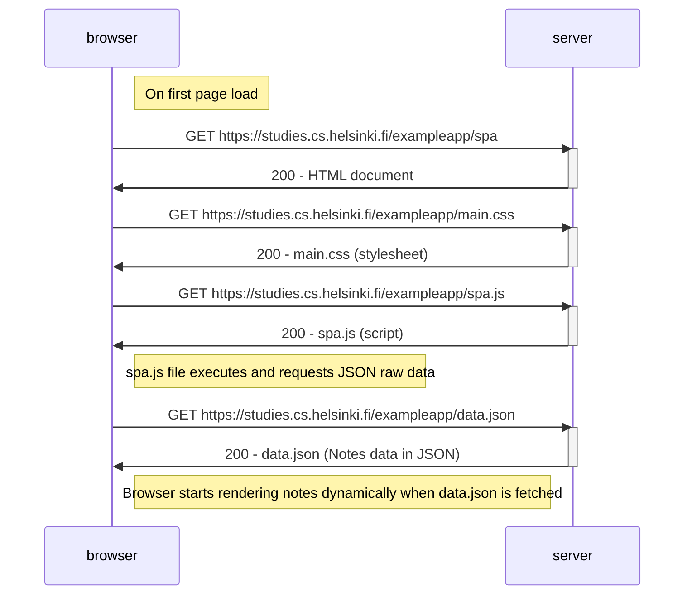

```mermaid
  sequenceDiagram
    participant browser
    participant server

    Note right of browser: On first page load
    browser->>server: GET https://studies.cs.helsinki.fi/exampleapp/spa
    activate server
    server->>browser: 200 - HTML document
    deactivate server

    browser->>server: GET https://studies.cs.helsinki.fi/exampleapp/main.css
    activate server
    server->>browser: 200 - main.css (stylesheet)
    deactivate server

    browser->>server: GET https://studies.cs.helsinki.fi/exampleapp/spa.js
    activate server
    server->>browser: 200 - spa.js (script)
    deactivate server

    Note right of browser: spa.js file executes and requests JSON raw data

    browser->>server: GET https://studies.cs.helsinki.fi/exampleapp/data.json
    activate server
    server->>browser: 200 - data.json (Notes data in JSON)
    deactivate server
    Note right of browser: Browser starts rendering notes dynamically when data.json is fetched 
```
