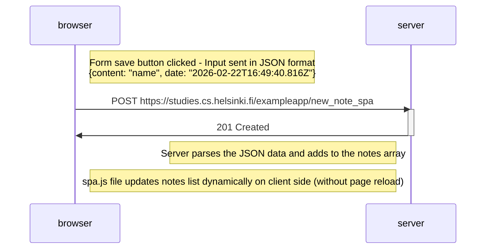

```mermaid
  sequenceDiagram
    participant browser
    participant server

    Note right of browser: Form save button clicked - Input sent in JSON format<br /> {content: "name", date: "2026-02-22T16:49:40.816Z"}
    browser->>server: POST https://studies.cs.helsinki.fi/exampleapp/new_note_spa
    activate server
    server->>browser: 201 Created
    deactivate server

    Note left of server: Server parses the JSON data and adds to the notes array
    Note right of browser: spa.js file updates notes list dynamically on client side (without page reload)
```
