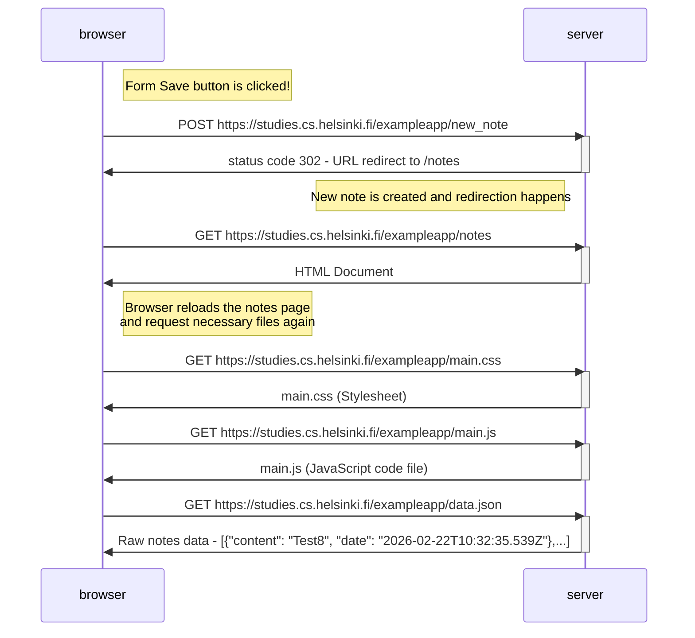

```mermaid
  sequenceDiagram
  participant browser
  participant server
  Note right of browser: Form Save button is clicked!

  browser->>server: POST https://studies.cs.helsinki.fi/exampleapp/new_note
  activate server
  server->>browser: status code 302 - URL redirect to /notes
  deactivate server
  Note left of server: New note is created and redirection happens

  browser->>server: GET https://studies.cs.helsinki.fi/exampleapp/notes
  activate server
  server->>browser: HTML Document
  deactivate server
  Note right of browser: Browser reloads the notes page <br /> and request necessary files again

  browser->>server: GET https://studies.cs.helsinki.fi/exampleapp/main.css
  activate server
  server->>browser: main.css (Stylesheet)
  deactivate server

  browser->>server: GET https://studies.cs.helsinki.fi/exampleapp/main.js
  activate server
  server->>browser: main.js (JavaScript code file)
  deactivate server

  browser->>server: GET https://studies.cs.helsinki.fi/exampleapp/data.json
  activate server
  server->>browser: Raw notes data - [{"content": "Test8", "date": "2026-02-22T10:32:35.539Z"},...]
  deactivate server
```
